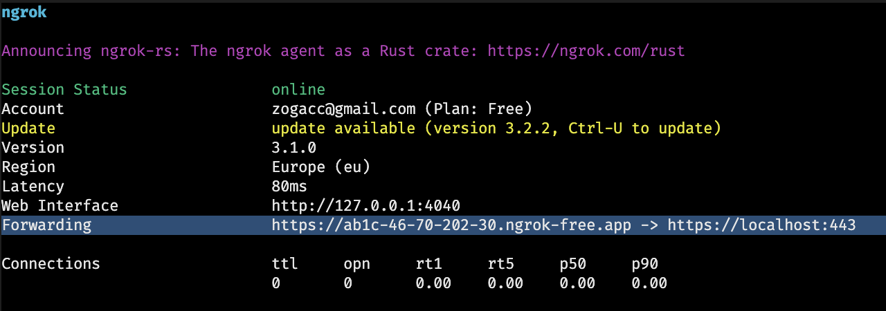
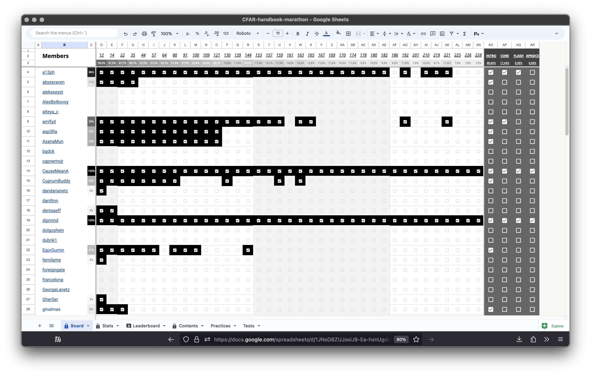

# Marathons bot

## Development

!!! NOTE: scripts in package.json is wrong, you need to remove fucking `pm2` and add ~~fucking~~ `Docker`

1. `./ngrok http https://localhost`
2. Copy "Forwarding address"
   - 
3. Paste to env variable `NGROK_URL`
4. Check that setted correct bot token (development, not production)
5. ! Run TS compiler for `.ts` files in Watch Mode (via VSCode)
6. Run `yarn start`

### Authorizing

// TODO: add instructions to get personal Google Service Account
// TODO: add instructions to get personal Telegram bot token*

### Spreadsheet

// TODO: add description and template for the marathon's table

## Tech stack

- Node.js
- TypeScript
- Telegraf.js (Telegram bot API)
- Google APIs (Sheets)

## TODOs

- [x] Стартовое меню с кнопками главных действий
- [x] Замена прослушивания по тексту, на прослушивание по командам. Сейчас из-за этого брешь в сценариях.
- [x] Указание названия главы вместо номера колонки с главой
- [x] Отображения статистики участника из таблицы
- [ ] Прослушивание чата марафона
- [ ] Публикация изображения таблицы в чате марафона
